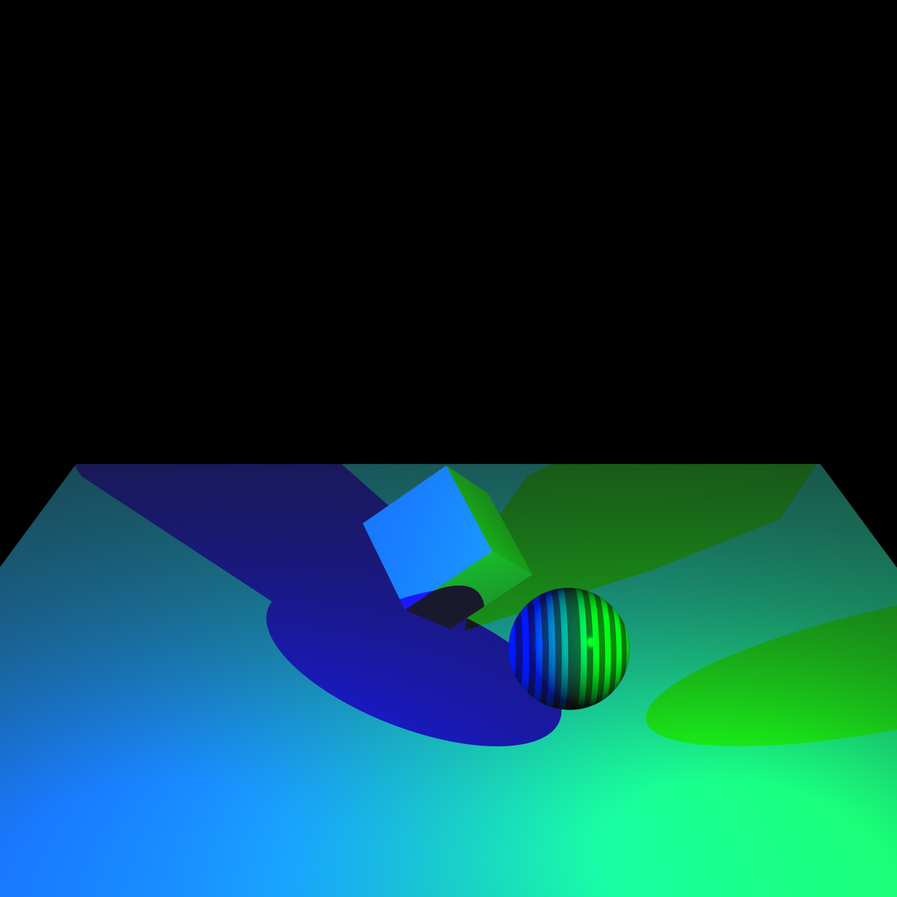
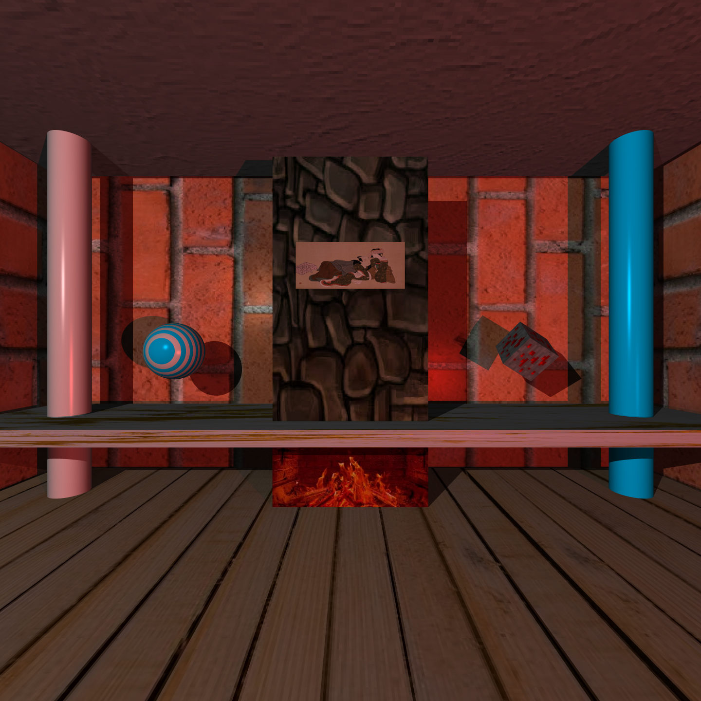

# Raytracing
For SMID look in file : `./src/Tools/Objects/Sphere.cpp`
## Features v1.0

### Choosable parameters with commands

- Load JSON file for construct scene
- Choose render scene
- Choose image height
- dis/enable shadows
- Super Sampling Anti Aliasing
- Save image in JPG

### Displayable

- Disponible objects : Cube, infinite cylinder, infinite plan, square, sphere
- Phong illumination
- Shadows
- Multi materials (line)
- Super Sampling Anti Aliasing
- Skysphere or solid color
- textures mapping

### Others

- Multithreading

### Screenshots

